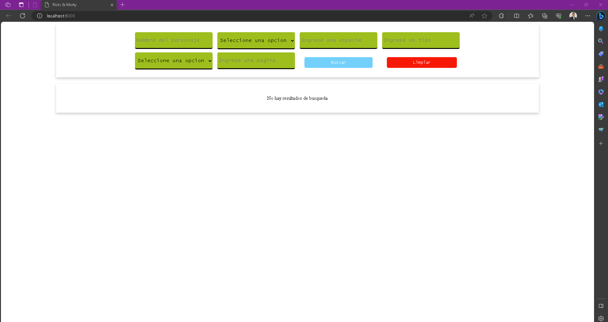
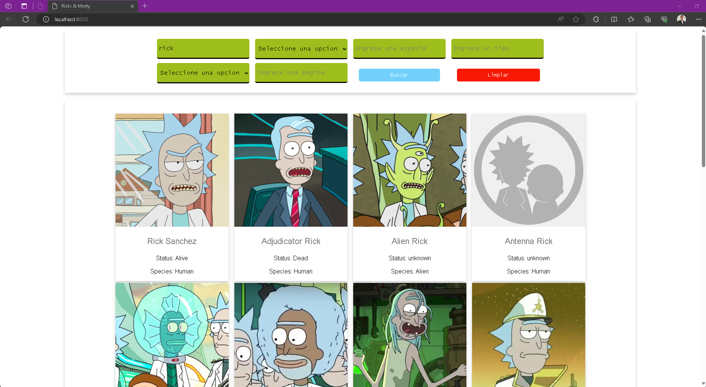
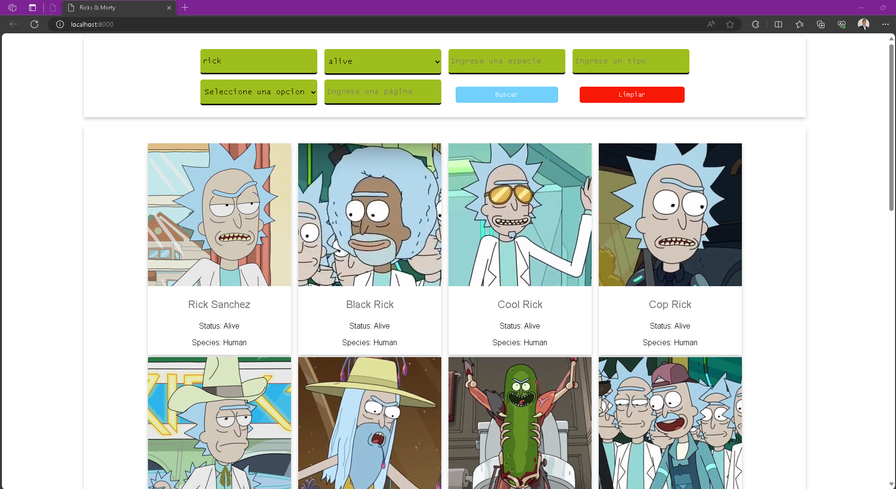

#Aplicativo Web, Uso de LitElement y Web Components

En este proyecto, hemos desarrollado una aplicación web que utiliza tecnologías como Lit Element y Web Components para crear una interfaz de usuario altamente modular y personalizable. Además, hemos integrado la funcionalidad de consumo de datos de una API externa para enriquecer la experiencia del usuario.
Este proyecto permite filtrar datos en la búsqueda de información y luego representarla en la vista a través de tarjetas.

##Lit Element y Web Components:
 En la base de nuestra aplicación se encuentran Lit Element y Web Components, que nos permiten crear componentes reutilizables y encapsulados con estilos y lógica específicos. Esta arquitectura modular mejora la legibilidad del código y la mantenibilidad del proyecto.

##Componentización: 
Hemos diseñado la interfaz de usuario de nuestra aplicación como una colección de componentes personalizados, como inputs, selectores, tarjetas, botones y más. Cada componente es independiente y puede reutilizarse en diferentes partes de la aplicación, lo que facilita la creación y personalización de nuevas funcionalidades.

##Consumo de API: 
Para enriquecer la aplicación con datos dinámicos, hemos incorporado la capacidad de consumir una API externa. Esto nos permite obtener información actualizada en tiempo real, como datos de personajes, películas o cualquier otro tipo de contenido. Hemos utilizado solicitudes HTTP para interactuar con la API y mostrar los datos en nuestra aplicación.

##Interactividad: 
Hemos implementado características interactivas que mejoran la experiencia del usuario, como la capacidad de búsqueda y filtrado de datos, así como la posibilidad de borrar y recargar los resultados.

##Estilos Personalizados:
 Hemos aplicado estilos personalizados utilizando CSS  para lograr una apariencia visual atractiva y coherente en toda la aplicación.

##Evidencias:

Inicio:

Busqueda por nombre:

Busqueda con selector:

